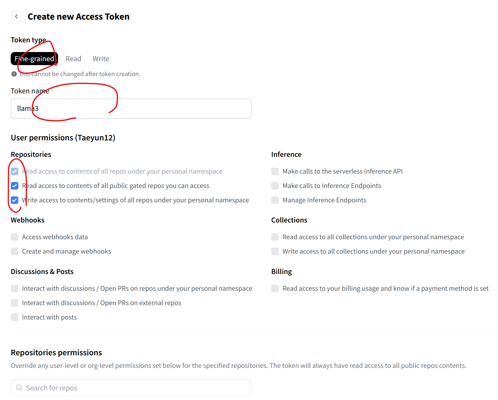

# inha-Llama3.2-Vision
인하대병원 Llama3.2 Vision 학습 및 추론 코드입니다.

환경 셋팅은 드린 첨부된 Dockerfile과 requirments.txt 파일을 이용하여 build하시면 될 것 같습니다.

## Train Data prepare
```json
[
    {
        "messages": [
            {
                "content": [
                    { "text": "<INPUT_TEXT>","type": "text" },
                    { "image": "<IMAGE_PATH>", "type": "image" }
                ],
                "role": "user"
            },
            {
                "content": [
                    { "text": "<OUTPUT_TEXT>", "type": "text"}
                ],
                "role": "assistant"
            }
        ]
    },
    ...
]
```
[data.json](./dataset/data.json)을 참고하시면 됩니다.
해당 파일의 형식과 동일해야 합니다.

* <INPUT_TEXT> : input으로 들어오는 conlcusion

* <IMAGE_PATH> : input으로 들어오는 CT 이미지. **반드시** `.jpg`, `.png` 확장자로 변환하여 사용해야 합니다.  

* <OUTPUT_TEXT>: output 텍스트

## Setting Huggingface Token
아래의 과정을 통해 Huggignface Token을 발급받고 등록해야 모델을 사용할 수 있습니다.

1. [Llama3.2 Vision Huggingface repo](https://huggingface.co/meta-llama/Llama-3.2-11B-Vision-Instruct)에 접속하여 접속 이후 License 동의.

2. [Huggingface Tokens](https://huggingface.co/settings/tokens) 접속 혹은 좌상단 프로필(1) 클릭 이후 Settings에 접속 -> (2) access token 클릭 -> (3) create new token 클릭

3. 아래의 그림에 맞게 체크한 후 하단의 **Create token**을 눌러 생성합니다. 이때, **반드시 Repositories에 해당하는 항목은 모드 체크해야 합니다.**


4. 이후 화면에 나오는 토큰 복사 후 저장합니다. (이후, 확인할 수 없지만 잃어버린다면 토큰 삭제 후 재발급 가능합니다.)

5. `huggingface_token.json`에 발급한 토큰을 넣어줍니다.
```json
{
    "TOKEN": "..."
}
```

#### How To Train
아래의 명령어를 통해 학습이 가능합니다.
```
python3 vllm_train.py
```

실제 학습은 아래 코드를 통해 진행합니다.
```python
from src.model import LlamaVision

llama_model = LlamaVision(token=TOKEN)
llama_model.train(
    dataset_path="./dataset/data.json",
    batch_size=1, 
    num_train_epochs=3,
    lora_alpha=16,  
    r=8,
    save_dir="fine-tuned-visionllama"
)
```

#### Train Args 설명
1. `dataset_path`(str) : train 데이터셋 파일의 경로입니다. 학습을 위해서는 반드시 채워주셔야 합니다.
2. `batch_size` (str, Optional) : eval 데이터셋 파일의 경로입니다. train data와 동일한 형식입니다.
3. `num_train_epochs` (str) : 학습할 epoch의 수 입니다. 1 epoch = train data를 전부 한 번 봅니다. default는 3입니다. 
4. `lora_alpha` (int) : LoRA의 alpha값입니다. default는 16입니다.
5. `r` (int) : LoRA의 rank값입니다. default는 8입니다. 
6. `save_dir` (int) : weight를 저장할 directory입니다. default는 `./fine-tuned-visionllama` 입니다.

#### How To Inference
아래의 명령어를 통해 추론이 가능합니다.

```
python3 vllm_inference.py
```

실제 추론은 아래 코드를 통해 진행합니다.
만약, pretrain한 모델로 inference를 하고 싶다면, `PRETRAIN_MODEL_DIR`에 학습한 모델의 경로를 넣어줘야 합니다.
```python
from src.model import LlamaVision
PRETRAIN_MODEL_DIR = "./fine-tuned-visionllama/checkpoint-1" # 모델 경로 예시
llama_model = LlamaVision(token=TOKEN, pretrain_model_dir=PRETRAIN_MODEL_DIR)
result = llama_model.inference(
    image="./image/test.jpg",
    text="Describe image simply.",
    max_new_tokens=400,  #
    num_return_sequences=1,
)
```

#### Inference Args 설명
1. `image`(str) : input으로 사용하는 이미지의 **경로**입니다.
2. `text` (str) : input으로 사용하는 텍스트입니다.
3. `max_new_tokens` (str) : 결과의 길이를 조절하는 파라미터입니다. output을 생성할 때, max_new_token을 넘어가면 생성을 종료하고 만들어진 텍스트까지만 반환합니다.
4. `num_return_sequences` (int) : input에 해당하는 결과 finding을 몇 개 만드는지 조절하는 파라미터입니다. 만약, 1이 아닌 값 n(2, 3, ...)으로 두게 되면 동일한 input에 해당하는 서로 다른 n개의 output이 만들어집니다.
